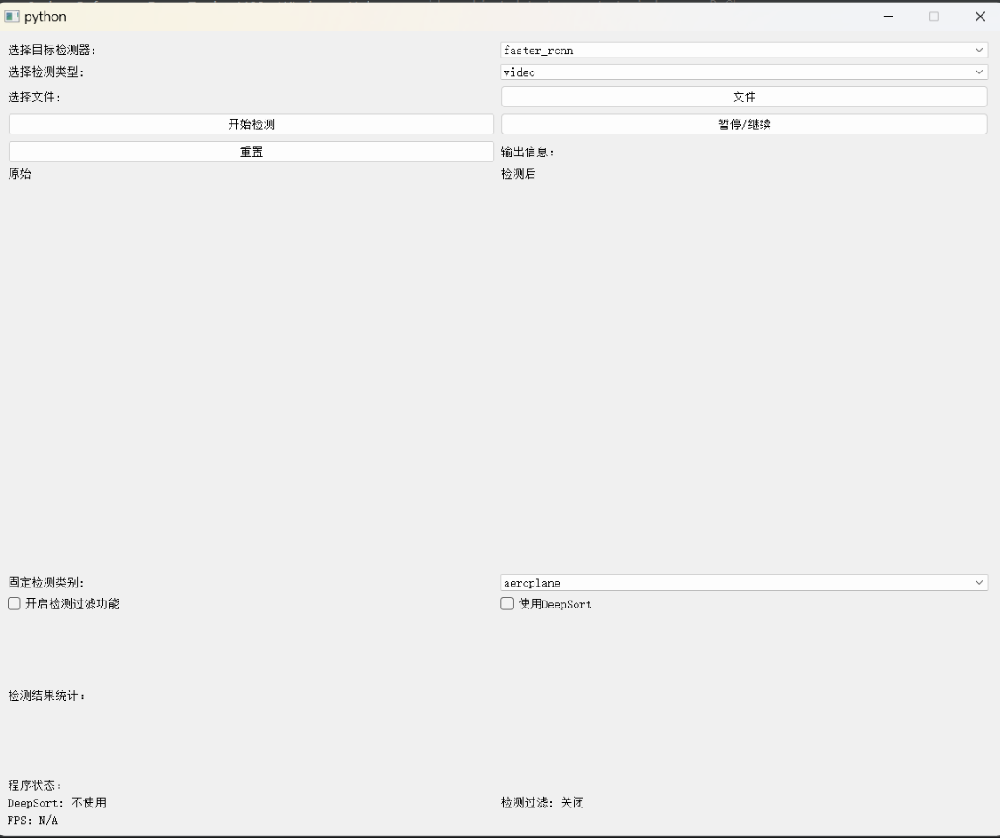

项目简述：使用Faster RCNN、SSD、YOLOv3SPP三种目标检测器为基础，结合DeepSort进行视频序列目标检测系统设计。

系统GUI：


### 使用方式

下载目标检测器模型权重：

链接：https://pan.baidu.com/s/1gFjfL_REla_ZpXSjcsphNw?pwd=djti 提取码：djti

分别将它们放入项目，放置路径文件路径如下：
```markdown
faster_rcnn:  'models/faster_rcnn/fasterrcnn_voc2012.pth'
ssd:  'models/ssd/save_weights/ssd300-14.pth'
yolov3spp: 'models/yolov3_spp/weigths/yolov3spp-14.pt'
```

配置好之后，配置运行环境（主要依赖在requirements.txt中）

运行项目

```cmd
python main.py
```

